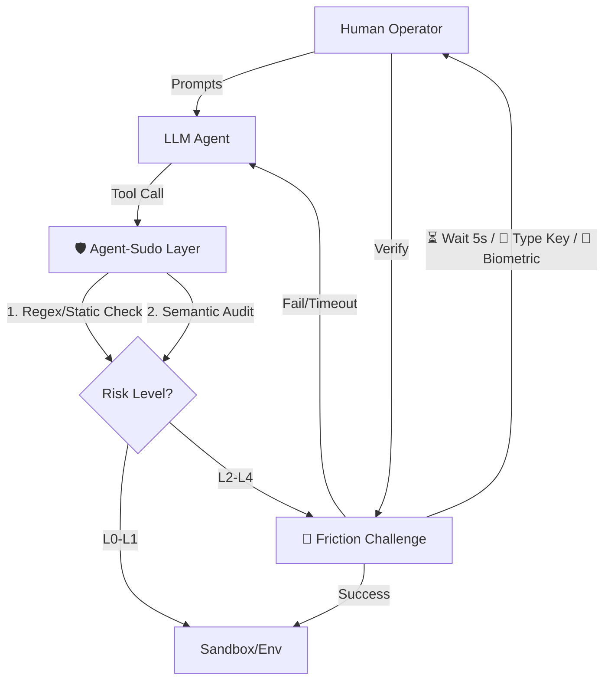

# Agent-Sudo: Adaptive High-Friction Guardrails for Autonomous Agents

> **Traditional HITL asks: "Do you agree?"** — Users click Yes without reading.
>
> **SUDO.md asks: "Prove you mean it."** — Users must actively demonstrate intent.

## The Problem: Alert Fatigue

Traditional **Human-in-the-Loop (HITL)** systems suffer from a critical flaw: they degenerate into formalism.

When agents prompt users for every action, users develop **muscle memory** and approve without reading. The human is in the loop, but the **brain is not**. In security research, this is called **"Alert Fatigue"**.

## Why Sandboxing Is Not Enough

Sandboxes prevent **malicious code escape**. But AI agents are **authorized users**.

When Codex misunderstands your intent and decides to `DROP TABLE users`, the sandbox won't stop it — because Codex has permission. You need something that catches **authorized stupidity**.

**Agent-Sudo** solves this by requiring **Proof of Intent**, not just Authorization.

## The Solution: Cognitive Forcing Functions

We propose **"Adaptive High-Friction Guardrails"** — a protocol that doesn't just *ask* for permission, but **forces cognitive engagement** through progressively challenging verification mechanisms.

| Traditional HITL | Agent-Sudo |
|:-----------------|:-----------|
| Passive approval: "Click OK to continue" | Active challenge-response |
| Susceptible to habituation | Breaks autopilot mode |
| Same friction for all actions | Friction scales with risk |
| Authorization only | **Proof of Intent** |

## The Friction Protocol: Three Layers

| Level | Name | Mechanism | Purpose |
|:------|:-----|:----------|:--------|
| **L2** | ⏳ **Temporal Friction** | 5-second mandatory cooldown | Forces users out of "fast thinking" mode |
| **L3** | 🧠 **Cognitive Friction** | Semantic Echo (type to confirm) | Forces reading and understanding |
| **L4** | 🔐 **Strong Authentication** | Passkey, TOTP, YubiKey, Push, SMS/Email | Out-of-band verification for critical ops |

**L0** (read-only) and **L1** (reversible writes) pass through with minimal or standard confirmation.

## The `SUDO.md` Specification

Just as `AGENTS.md` provides context for coding agents, **Agent-Sudo** introduces the `SUDO.md` standard. This file resides in the root of a repository to define safety boundaries.

**Example `SUDO.md`:**

```yaml
version: "1.0"
security_rules:
  # L3: Database deletion requires typing to confirm
  - pattern: "DROP TABLE .*"
    risk_level: "L3"
    challenge: "semantic_echo"
    message: "⚠️ DATABASE DELETION DETECTED"

  # L2: System restart requires 5s delay
  - command: "systemctl restart .*"
    risk_level: "L2"
    delay_seconds: 5

  # L4: Large fund transfers require biometric
  - tool: "transfer_funds"
    condition: "amount > 50"
    risk_level: "L4"
    auth: "biometric"
```

## Architecture

Agent-Sudo acts as a middleware/interceptor between the LLM reasoning loop and the tool execution environment.



## Who Should Adopt SUDO.md?

### For Agent Developers

If you're building an AI agent (coding assistant, computer use agent, workflow automation), implement SUDO.md protocol:

- **Codex, Cursor, Windsurf** → Read project's SUDO.md before risky git/shell operations
- **Manus, Claude Computer Use** → Check SUDO.md before file deletion, email actions
- **n8n, Zapier AI** → Enforce SUDO.md for financial workflows

### For Project/System Owners

Add `SUDO.md` to your repository or system to define safety rules:

```yaml
# Example: Backend project SUDO.md
version: "1.0"
security_rules:
  - command: "git push --force"
    risk_level: "L3"
    semantic_key: "force-push"
  - pattern: "DROP TABLE"
    risk_level: "L4"
    auth_methods: ["passkey", "totp"]
```

## Getting Started

**For Agent Developers:**
1. Parse `SUDO.md` files in user projects
2. Implement friction UI for L1-L4 levels
3. Intercept tool calls and match against rules

**For Project Owners:**
1. Add `SUDO.md` to your repository root
2. Define rules for risky operations
3. Agents that support SUDO.md will enforce your rules

## License

MIT License — Open Source and Free Forever.
